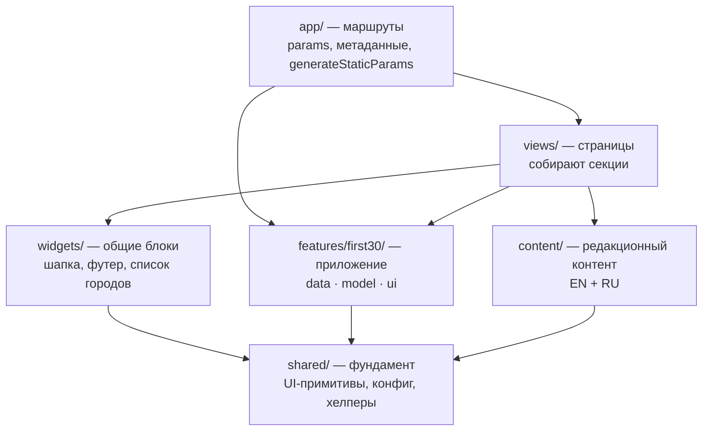
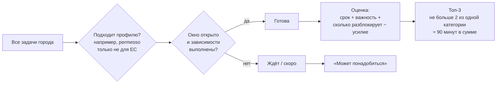
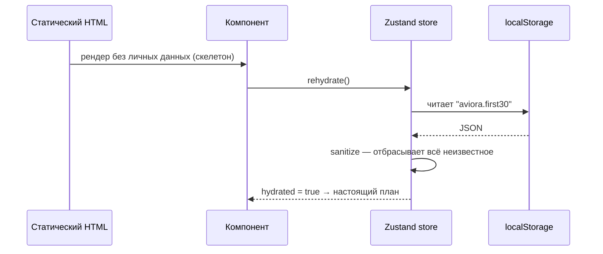

# Aviora · FIRST 30

**Discover Italy. Study here. Live here.**

**Демо:** https://maksiho5.github.io/aviora/

Aviora — сайт про учёбу и жизнь в Италии: университеты, поступление, города, бытовые вопросы и менторство от студентов. Внутри него живёт **FIRST 30** — небольшое приложение для иностранного студента, который только что прилетел в Милан. Оно каждый день показывает три дела на сегодня, в правильном порядке, с учётом того, что от чего зависит.

> Студентам не хватает не информации, а приоритетов. FIRST 30 отвечает на один вопрос: «что мне сделать сегодня?»

---

## Что можно посмотреть

| Раздел | Адрес | Что там |
|---|---|---|
| Главная | `/en`, `/ru` | Идея проекта, учёба, мелочи жизни, города, практичная Италия |
| Учёба | `/en/study` | Поступление по шагам, университеты, стипендии |
| Города | `/en/cities`, `/en/cities/milan` | Пять городов через учёбу, жизнь, расходы и открытия |
| Практика | `/en/practical` | Документы, жильё, транспорт, банк, медицина |
| Менторство | `/en/mentorship` | Алия, исследование на 150+ студентах, четыре формата, связь через Telegram |
| Команда | `/en/team` | Основатели проекта |
| **FIRST 30** | `/en/first-30` | Лендинг приложения и выбор города |
| Приложение | `/en/first-30/milan` | Онбординг → дашборд → задача → месяц → карта → бюджет |
| Кейс | `/en/case-study` | Как проектировался продукт: 16 разделов от исследования до рефлексии |

Чтобы попробовать приложение, откройте `/en/first-30/milan/onboarding`, укажите дату приезда, и дашборд соберёт ваш месяц. Задачи города лежат в данных, поэтому следующий город добавляется одним файлом, без изменений интерфейса.

Сайт на двух языках (EN и RU), со светлой и тёмной темой, адаптирован под телефон от 360px.

---

## Технологии

| | |
|---|---|
| Фреймворк | Next.js 16 (App Router, Turbopack), React 19 |
| Язык | TypeScript (strict) |
| Стили | Tailwind CSS 4, дизайн-токены в CSS-переменных |
| Локализация | next-intl (EN, RU), ICU-сообщения с плюралами |
| Состояние | Zustand + persist (localStorage) |
| Тесты | Vitest |
| Хостинг | GitHub Pages (статический экспорт), Vercel или Docker |

Бэкенда нет. Все страницы генерируются заранее для обоих языков, поэтому сайт отдаётся с CDN и выдерживает любой трафик. Прогресс студента хранится только в его браузере: ни аккаунтов, ни форм, ни сбора персональных данных.

---

## Архитектура

### Слои



Зависимости идут в одну сторону: сверху вниз. Маршруты в `app/` тонкие и только связывают URL со страницей. Логика FIRST 30 написана чистыми функциями и не зависит от React.

### Структура папок

```
src/
├── app/
│   ├── (entry)/                 корневой "/" — выбор языка на статическом хостинге
│   └── [locale]/
│       ├── (site)/              редакционные страницы с шапкой и футером
│       └── first-30/[city]/     приложение со своей оболочкой и вкладками
├── views/                       одна папка на страницу: home, study, cities, ...
├── widgets/                     site-header, site-footer, city-index, practical-grid
├── features/first30/
│   ├── data/                    города: задачи, зависимости, источники, места
│   ├── model/                   priorities, day, budget, store, sanitize — чистая логика
│   └── ui/                      dashboard, onboarding, task-detail, timeline, map, budget
├── content/                     cities, mentorship, case-study (EN + RU)
├── shared/
│   ├── ui/                      Button, Eyebrow, Circled, ThemeToggle, LanguageSwitch...
│   ├── config/                  site, seo, theme
│   ├── lib/                     cn, localized
│   └── assets/                  реестр изображений (статические импорты → blur-плейсхолдеры)
├── i18n/                        routing, request, navigation
└── proxy.ts                     редирект на язык по Accept-Language (на сервере)
messages/                        en.json, ru.json — строки интерфейса
scripts/                         проверка переводов, подготовка статического экспорта
```

### Как FIRST 30 выбирает три дела на сегодня



- `features/first30/model/priorities.ts` — чистая функция `planDay(tasks, resolved, day)`.
- Задача, от которой зависят другие (например, codice fiscale → банк, SIM, проездной), поднимается выше.
- Просроченное выходит наверх со спокойной формулировкой, без тревожных красных счётчиков.
- Завтра список другой: открываются новые задачи. Это главный повод вернуться в приложение.

Тест `priorities.test.ts` фиксирует экран из ТЗ. На 7-й день: Residence registration, Student ID, Find a supermarket, а ниже Transport, Healthcare и Bank account.

### Данные пользователя



Сохранённые данные проходят валидацию (`model/sanitize.ts`): испорченный или подменённый localStorage не уронит приложение. Пока стор не загружен, запись в него заблокирована, поэтому прогресс одного города не затрёт другой.

### Дизайн

Концепция **Morning Edition**: спокойный бумажный журнал об Италии и его страница «сегодня» для только что прилетевшего студента.

- Палитра из мудборда клиента: Cotton `#F2F3ED`, Forest `#4C513A`, Linen `#DDCCB7`, Cedar `#292728`.
- Cormorant italic — голос человека (заголовки, цитаты, советы студентов). Inter — факты (сроки, суммы, кнопки).
- Арки, плёночное зерно, золото только как акцент.
- Цвет приоритета всегда продублирован формой точки и словом (WCAG 2.2 AA), есть тёмная тема и `prefers-reduced-motion`.

---

## Запуск

```bash
npm install
npm run dev          # http://localhost:3000
npm run check        # lint + типы + тесты + сверка ключей перевода
npm run build        # продакшн-сборка (standalone)
npm start
```

Перед продакшн-сборкой скопируйте `.env.example` в `.env` и укажите `NEXT_PUBLIC_SITE_URL`.

## Деплой

| Куда | Как |
|---|---|
| **GitHub Pages** | Автоматически при пуше в `main` (`.github/workflows/deploy-pages.yml`): проверки → статический экспорт с `basePath` → публикация |
| **Vercel** | Импортировать репозиторий, задать `NEXT_PUBLIC_SITE_URL`. Работают proxy, оптимизация картинок и security-заголовки |
| **Docker** | `docker build -t aviora . && docker run -p 3000:3000 aviora` |

Чем отличается GitHub Pages: это статический хостинг, поэтому в CI убираются server-only файлы (`proxy.ts`, catch-all 404), язык выбирается на клиенте, а изображения отдаются без серверной оптимизации. На Vercel и в Docker работает полная версия с CSP, HSTS и AVIF/WebP.

## Как добавить город

1. Создать `src/features/first30/data/<city>.ts` по типу `CityGuide`: задачи, окна по дням, зависимости, источники.
2. Зарегистрировать город в `data/index.ts` и добавить id в `CityId`.

Тесты сами проверят уникальность id, существование зависимостей и отсутствие циклов. Интерфейс менять не нужно.

## Важно про контент

Сборы, адреса и процедуры меняются. На каждой странице задачи есть ссылка на официальный источник, сверяйте их перед каждым набором. Фотографии взяты из мудборда клиента: перед публичным запуском нужно подтвердить права на них.
